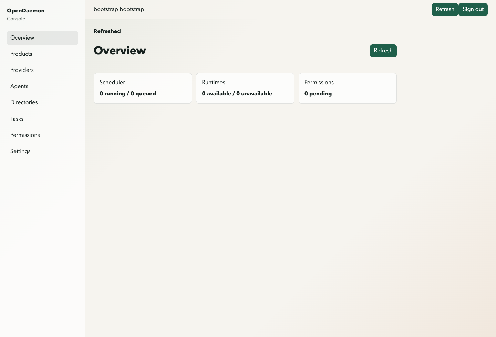

# OpenDaemon

OpenDaemon is a local daemon for coordinating AI coding providers, workspace
permissions, and task execution from local products.

The daemon exposes a loopback HTTP API, a product-scoped authentication model,
provider registry metadata, runtime detection, task/event APIs, and a local web
console served from `/console`.

## Current Capabilities

- local daemon API on `127.0.0.1:19514` by default
- bootstrap-managed products and product API tokens
- scope-based authorization for `/v1/*` routes
- provider registry manifests for Codex, Claude, and a generic test provider
- runtime detection for installed provider CLIs
- durable stores for products, tokens, agents, directory grants, and tasks
- task creation, cancellation, and event streaming
- local Leptos console UI backed by `opendaemon-console-api`
- optional control-plane enrollment when configured by environment

OpenDaemon is designed as a local service. Do not expose it on a public
interface unless you have deliberately reviewed and accepted that risk.

## Repository Layout

```text
src/                              daemon, API, scheduler, registry, stores
crates/opendaemon-console-api/    browser API client and DTOs
crates/opendaemon-console-ui/     Leptos CSR console application
console/                          Trunk entrypoint for console assets
registry/providers/               committed provider manifests
docs/                             design and security notes
e2e/                              Python end-to-end tests
scripts/                          project helper scripts
```

## Requirements

- Rust toolchain with edition 2024 support
- `just` for the documented project commands
- `trunk`, `wasm-bindgen`, and the `wasm32-unknown-unknown` Rust target for
  building the console UI
- `uv` for Python e2e test environment management

Install the expected local tooling:

```bash
just init
just init-e2e
```

## Running The Daemon

Set a local bootstrap token before starting the daemon:

```bash
export OPENDAEMON_BOOTSTRAP_TOKEN="replace-with-a-random-local-token"
cargo run -- daemon
```

By default the daemon listens on `127.0.0.1:19514`. Override the bind address
with CLI flags or environment variables:

```bash
cargo run -- daemon --host 127.0.0.1 --port 19514

export OPENDAEMON_DAEMON_HOST=127.0.0.1
export OPENDAEMON_DAEMON_PORT=19514
```

`GET /health` is unauthenticated and can be used as a local readiness check.

## Building The Console

The daemon serves the web console from `/console`. Build the WASM assets with
Trunk before using the full UI:

```bash
cd console
trunk build
```

Then start the daemon and open:

```text
http://127.0.0.1:19514/console
```

If `console/dist` has not been built, `/console` serves a small placeholder
page.



## Authentication

OpenDaemon uses two bearer credential types:

1. bootstrap token for product-management routes
2. product API tokens for product-scoped daemon routes

Create a product with the bootstrap token:

```bash
curl \
  -H "Authorization: Bearer $OPENDAEMON_BOOTSTRAP_TOKEN" \
  -H "Content-Type: application/json" \
  -d '{"id":"product_example","display_name":"Example Product"}' \
  http://127.0.0.1:19514/v1/products
```

Issue a product token:

```bash
curl \
  -H "Authorization: Bearer $OPENDAEMON_BOOTSTRAP_TOKEN" \
  -H "Content-Type: application/json" \
  -d '{"label":"local-dev","scopes":["providers:read","tasks:create","tasks:read","tasks:cancel"]}' \
  http://127.0.0.1:19514/v1/products/product_example/tokens
```

The plaintext product token is returned only once at creation time.

Call product-scoped routes with the product token:

```bash
curl \
  -H "Authorization: Bearer odpk_..." \
  http://127.0.0.1:19514/v1/providers
```

## API Surface

Unauthenticated:

- `GET /health`
- `GET /console`
- `GET /console/*`

Bootstrap token:

- `GET /v1/products`
- `POST /v1/products`
- `GET /v1/products/{product_id}`
- `PATCH /v1/products/{product_id}`
- `GET /v1/products/{product_id}/tokens`
- `POST /v1/products/{product_id}/tokens`
- `DELETE /v1/products/{product_id}/tokens/{token_id}`

Product token:

- `GET /v1/session`
- `GET /v1/daemon/status`
- `GET /v1/providers`
- `GET /v1/providers/{provider_id}`
- `GET /v1/runtimes`
- `POST /v1/runtimes/detect`
- `GET /v1/tasks`
- `POST /v1/tasks`
- `GET /v1/tasks/{task_id}`
- `GET /v1/tasks/{task_id}/events`
- `POST /v1/tasks/{task_id}/events`
- `POST /v1/tasks/{task_id}/cancel`
- `GET /v1/permissions`
- `GET /v1/agents`
- `POST /v1/agents`
- `GET /v1/agents/{agent_id}`
- `PATCH /v1/agents/{agent_id}`
- `DELETE /v1/agents/{agent_id}`
- `GET /v1/directories`
- `POST /v1/directories/grant`
- `GET /v1/directories/{directory_id}`
- `PATCH /v1/directories/{directory_id}`
- `DELETE /v1/directories/{directory_id}`

## Provider Registry

Provider metadata lives under `registry/providers/*/manifest.json`. Validate
committed registry fixtures and schema freshness with:

```bash
just registry-check
```

Runtime detection uses provider manifest `detect` configuration and can be
overridden with provider-specific environment variables such as
`OPENDAEMON_PROVIDER_CODEX_PATH`.

## Optional Control Plane

The daemon can enroll with a control plane when both values are present:

```bash
export OPENDAEMON_CONTROL_PLANE_URL="https://example.invalid"
export OPENDAEMON_CONTROL_PLANE_ENROLLMENT_SECRET="replace-with-secret"
```

If either value is absent, control-plane integration is disabled.

## Development

Common commands:

```bash
just test
just build
just e2e
just registry-check
just prek
```

The stricter Rust gate used during development is:

```bash
cargo fmt --all
cargo check --workspace --all-targets
cargo test --workspace --all-targets
cargo clippy --workspace --all-targets -- -D warnings
cargo build --workspace --all-targets --release
```

Unit and integration-style Rust tests live in the workspace crates. Python e2e
tests live in `e2e/` and are run through `uv`.

## Security Notes

- Treat bootstrap tokens and product tokens as local machine credentials.
- Keep the daemon bound to loopback unless you are deliberately changing the
  local trust boundary.
- Do not pass daemon credentials through task payloads, provider config, or
  child-process environment variables.
- Provider CLIs may send prompts, code context, and workspace contents to their
  vendors according to each provider's policy.

See [docs/security/local-api-auth.md](docs/security/local-api-auth.md) for the
local API authentication boundary notes.
